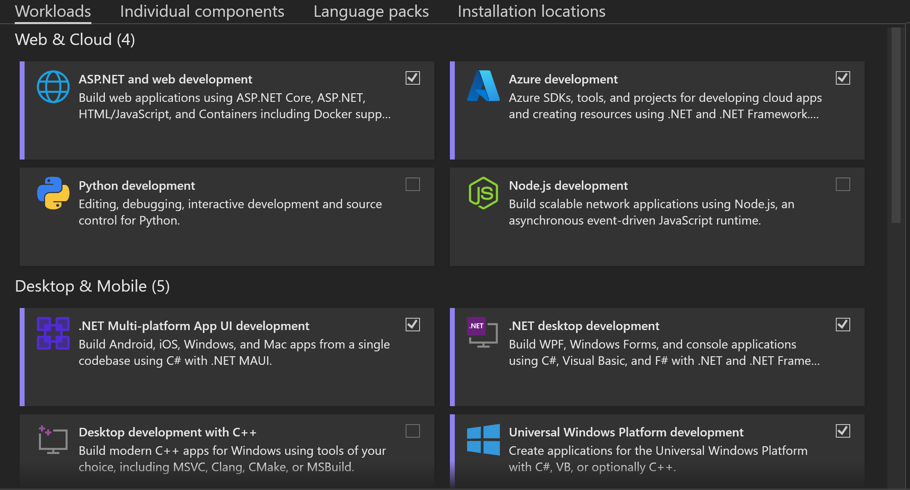

# Code Examples for Software Development I Course

## Introduction

This repository contains code examples and documentation you will see during practice lectures.  

All examples are provides as is and is intended only for learning purposes. Some examples are intended to display "bad code" or "bad practices", others might be correct but provide overly simplified solutions so **never** use provided examples as a production ready code (as it really is not production ready).

## Repository Structure

This repository contains separate folder for every practice lecture (for example for first lecture there is a folder named "Lecture01").  
Every practice lecture folder contains one or more subfolders for every topic that was discussed.

## Getting Started

Many examples are provided as *.dib files. It is a .NET Notebook file format. It is best viewed using Visual Studio Code with .NET Notebooks extension installed ([full installation instructions](https://github.com/dotnet/interactive/blob/main/docs/install-dotnet-interactive.md#visual-studio-code))

All code examples that are provided as Visual Studio solutions (*.sln files) were tested and compiled using Visual Studio 2022 with the following workloads installed:

## Lectures

- [Lecture 01](Lecture01/README.md)
- [Lecture 02](Lecture02/README.md)